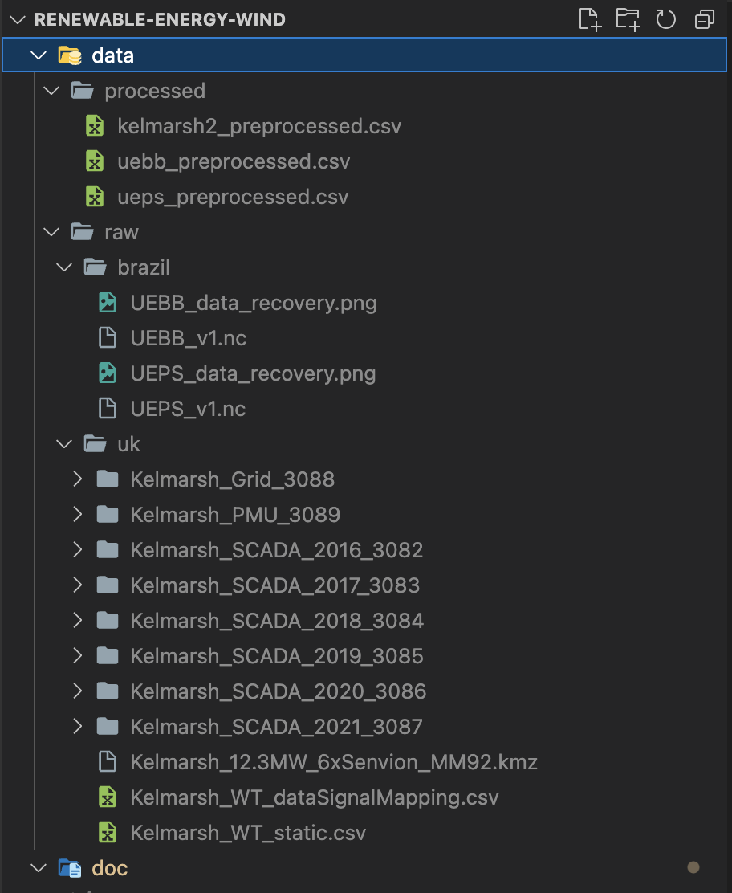

# How to get started

1. **Clone git repo**

2. **Download all data of the following websites**:
  - Two Brazilian datasets: https://zenodo.org/record/1475197#.ZD6iMxXP2WC
  - Uk dataset: https://zenodo.org/record/5841834#.ZEajKXbP2BQ
    
3. **Store data in `data/raw` folder** such that it looks like this:

4. **To get an overview start by looking at the `doc` folder**
    - Run `create_processed_data.ipynb` once in the beginning
    - There is one main IPython notebook per farm containing the high-level call of functions and the results (called `..._main`)

5. **`Exp` folder** contains experiments and data exploration

# Summary of task, approach and results 
- **Task**: There are three wind farms. Predict the power generated by one turbine per wind farm for the next step (=10min), next hour and next day

- **Givens**: 3 datasets 
    - UK: Kelmarsh wind farm (=kwf) Shape: (288900,299) per turbine
    - Brazil: Beberide wind farm (=uebb) Shape: (52560,40) per turbine with 5 extra height dimension
    - Brazil: Pedra do Sal wind farm (=ueps) Shape (52560,48) with 6 extra height and 26 range dimensions

- **Approach**: More or less the same approach taken for all three datasets. For each dataset: 
    1. Parse data to .csv and ignore all data but the turbine of interest (see `data_loader.py`)
    2. Make time-series data a supervised problem and generate smart features (see `preprocessing.py`)
    3. Train ordinary linear least squares (=OLS) on scaled data for each farm and each prediction horizon (i.e., 3 farms * 3 predictions = 9 models) (see `model.py`)
    4. Try out different approaches with HPO, if the benchmark was not beaten by OLS
    5. Visualize results (see `visualizations.py`)

A **more detailed** documentation of the approach can be found in the `src` folder in the docstring of the functions

## Results

The benchmark was slightly beaten / met by OLS on all windfarms for all time horizons except for the 10min time horizon of Kelmarsh wind farm. There xgboost with HPO was used. Below you can find the performance metrics of Bebride wind farm together with plot that shows the comparison between prediction and ground truth.

| Model Name              |    RMSE |   Benchmark_RMSE |      MAE |   Benchmark_MAE |
|:------------------------|--------:|-----------------:|---------:|----------------:|
| Beberide 10min horizon  |  52.419 |          55.4172 |  34.4326 |         36.245  |
| Beberide 1 hour horizon | 111.705 |         119.25   |  79.5705 |         81.9437 |
| Beberide 1 day horizon  | 178.472 |         196.742  | 130.307  |        151.508  |

## Sidenotes:
- **Dimensionality reduction**: Manually drop columns if too many NaNs and collapse height and range dimension of the Brazilian datasets to binary
- **Model selection and HPO**: Manually chose xgboost due to good results, with hand-tuned hyperparameters
- **No global model or transfer learning approach taken**
- For the brazilian datasets: Lots of useful feature information in the xarray data structure that is lost once transferred to pandas

